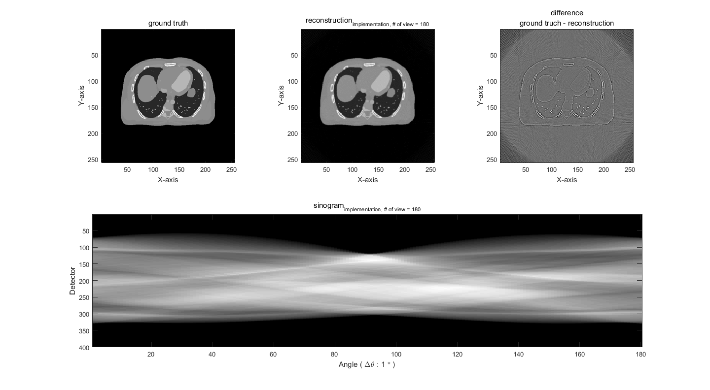

# Parallelbeam CT

### Reference 
[Computed Tomography: Principles, Design, Artifacts, and Recent Advances, 3rd.](http://bitly.kr/SOw7Yb1s)

    Please read Chapter 3. Image Reconstruction.

### Abstract
X-ray computed tomography (CT) has experienced an explosion of technological development for a quarter century. Six years after the second edition of Computed Tomography, this third edition captures the most recent advances in technology and clinical applications. New to this edition are descriptions of iterative reconstruction, statistical reconstruction, methodologies used to model the CT systems, and the searching methodologies for optimal solutions. A new section on 3D printing introduces approaches by early adopters in the area. Also added is a description and discussion of the size-specific dose estimate, an index that attempts to more accurately reflect the dose absorption of specific-sized patients. The coverage of dual-energy CT has been significantly expanded to include its background, theoretical development, and clinical applications.
      
## Projection
* Projection operator is implemented based on Ch.3 Equations (3.5) & (3.6).
* Ray-driven method is applied to Projection operator.

    * Ch.3 Equation (3.5): `Rotated coordinate` X-ray CT system (`Counterclockwise`).
        * 
        * 

    * Ch.3 Equation (3.6): `Line integration` along X-ray.
        * 

## Filtering
* Filtering operator is implemented based on Ch.3 Equations (3.28) & (3.29) & (3.30).

* `Filtering kernel` is generated by Equation (3.29).
    * 
        
* Filtering is performed by `convolution ver.` using Ch.3 Equation (3.30) and `FFT ver.` using Equation (3.28).
    * Ch.3 Equation (3.30): `convolution ver.` 
        * 
    * Ch.3 Equation (3.28): `FFT ver.`
        * 

## Backprojection
* Backprojection operator is implemented based on Ch.3 Equation (3.22).
* Pixel-driven method is applied to backprojection operator.

    * Ch.3 Equation (3.22): `Backprojection`
        * 
        
## Parameters
* X-ray CT System parameters
    1. dAngle `[degree]` : Rotational range of X-ray source 
    2. nView `[unit]` : The number of views 
    3. dView `[degree]` : The step of views
    4. DSO `[mm]` : Distance from Source to Object
    5. DSD `[mm]` : Distance from Source to Detector 

* X-ray detector parameters
    1. dDctX `[mm]` : Detector pitch
    2. nDctX `[unit]` : The number of detectors
    3. dOffsetDctX `[float]` : Index of shifted detectors (+, -)
    4. compute_filtering `[convolution, fft]` : Filtering method
    
* Object parameters 
    1. dImgX, dImgY `[mm]` : Pixel resolutions
    2. nImgX, nImgY `[unit]` : The number of pixels
    3. dOffsetImgX, dOffsetImgY `[float]` : Index of shifted image (+, -)

## Results

* The results were reconstructed by below hyper parameters.

* X-ray CT System parameters
    1. dAngle `[degree]` : 360 
    2. nView `[unit]` : 360 
    3. dView `[degree]` : 1
    4. DSO `[mm]` : 400
    5. DSD `[mm]` : 800 

* X-ray detector parameters
    1. dDctX `[mm]` : 0.7
    2. nDctX `[unit]` : 400
    3. dOffsetDctX `[float]` : 30
    4. compute_filtering `[convolution, fft]` : 'fft'
    
* Object parameters 
    1. dImgX, dImgY `[mm]` : 1, 1
    2. nImgX, nImgY `[unit]` : 256, 256
    3. dOffsetImgX, dOffsetImgY `[float]` : 0, 0
